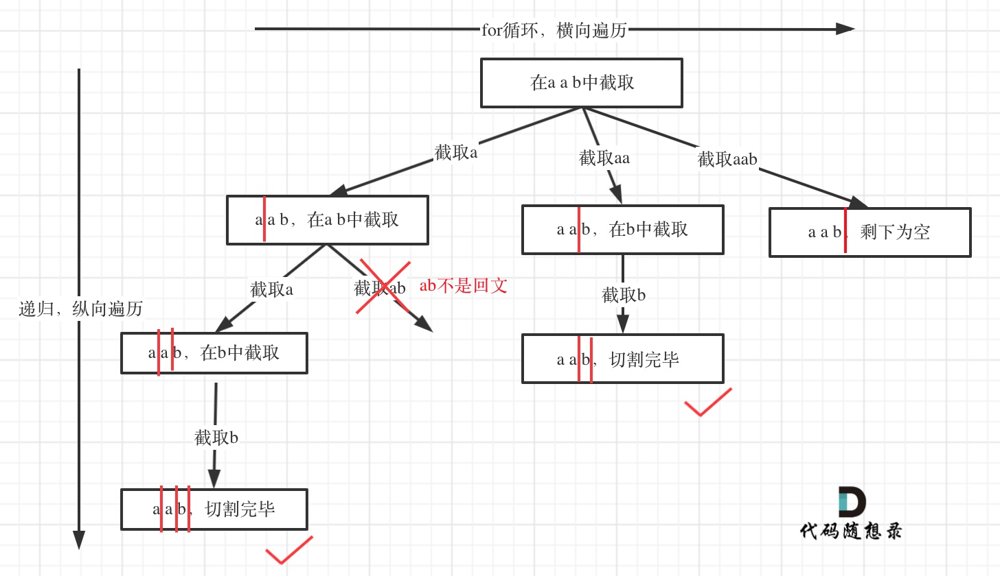

# LeetCode131_Partition_middle

> [LeetCode131](https://leetcode.cn/problems/palindrome-partitioning/description/)

如下图所示，要想通的地方有两个点：

1. startIndex 就是隔板，i 对应的是另一个隔板，startIndex-i 就是对应的字符串
2. 回溯回的是板子，将板子对应的字符串除去。

