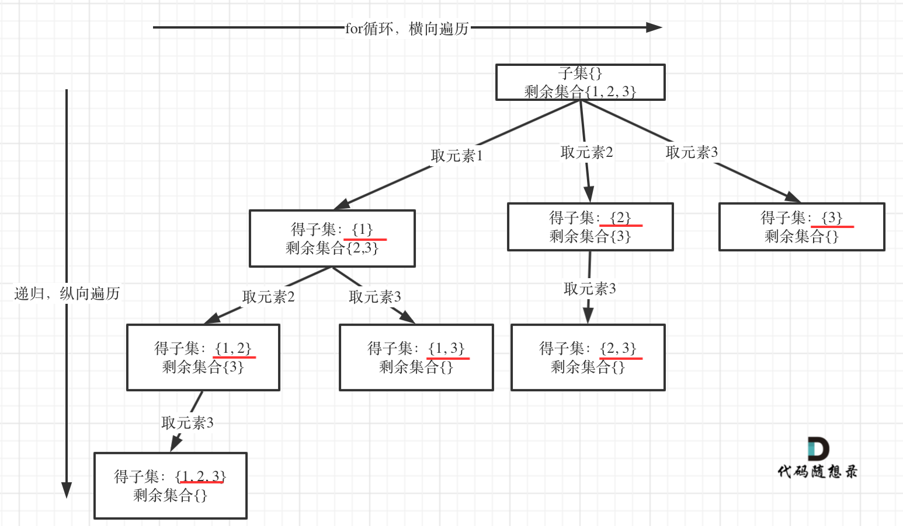

# LeetCode78_Subsets_middle

> [LeetCode78](https://leetcode.cn/problems/subsets/description/)

这就是新的类型题目，如果初次接触此类题目，我们画一下回溯的树形图，如下所示：

我们可以发现我们要收集的元素都是在每个节点上，而不是像之前的题目，需要收集的元素都在叶子节点上。
因此我们需要更改一下收集节点的时机，经过上述的题目的试炼，我们很简单认识到应该在进入节点或者出节点的时候进行元素收集。
如下代码所示：

```C#
public class Solution {
    List<int> path;
    List<IList<int>> res;
    public IList<IList<int>> Subsets(int[] nums)
    {
        path = new();
        res = new();
        res.Add([]);
        BackTracking(nums,0);
        return res;
    }

    private void BackTracking(int[] nums, int startindex)
    {
        // res.Add([..path]); 在这进行 Add 也可，相当于在出节点的时候 Add，结果是一样的
        if (startindex >= nums.Length) return;

        for (int i = startindex; i < nums.Length; i++)
        {
            path.Add(nums[i]);
            res.Add([.. path]);
            BackTracking(nums, i + 1);
            path.RemoveAt(path.Count - 1);
        }
    }
}
```
