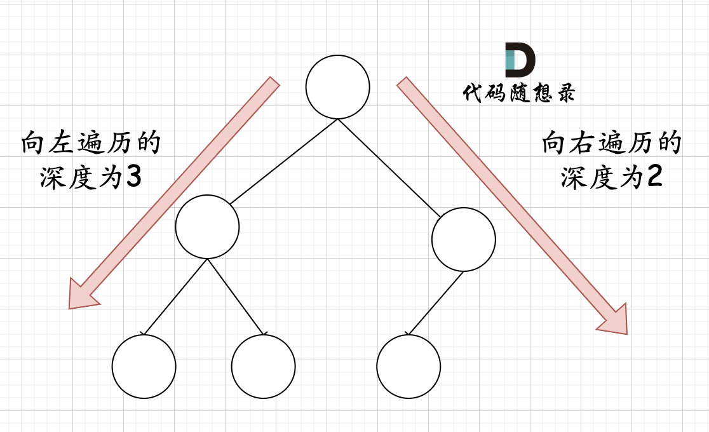
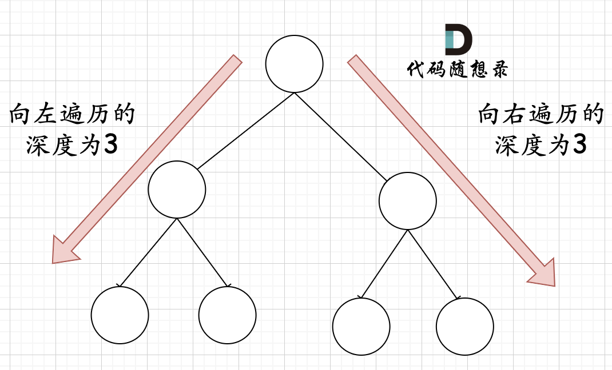
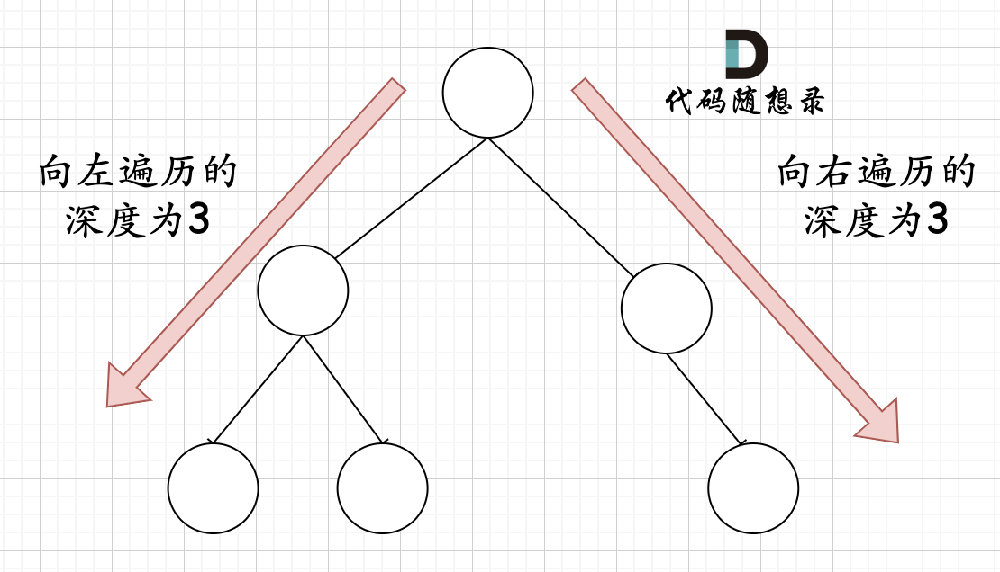

# LeetCode222_CountNodes 计算二叉树的节点数量_Easy

如果遍历每个节点个数（不论用前序、中序、后序、层序），然后每次找到一个就计数，这道题很简单。但是如果利用上完全二叉树和完美二叉树的定义，时间复杂度将更低。

完美二叉树有一个性质：节点个数  = $2^h$-1，h 为树高。
因此，我们可以利用这个特性简化节点个数的计算。

## 思路如下

完全二叉树如下所示：

可以发现，最多有可能有一边子树为非完美二叉树，对于非完美二叉树我们继续递归，直达达到最后一个节点，一个节点肯定是完美二叉树。
而完美二叉树就可以使用上述的公式直接计算节点个数。
那么问题就在于如何判断完美二叉树。

### 判断完美二叉树

判断完美二叉树的方式可以一直往左迭代数个数，同时一直往右迭代个数，最后比较两边个数是否相同即可判断是否是完美二叉树。

可能会疑虑到如下中间空一个节点就不符合上述思路了，但是注意题目中大要求是完全二叉树，下图这棵树并不符合完全二叉树。


综上，代码如下：

```C#
public int CountNodes(TreeNode root)
{
    GetTreeNodes(root);
}

// 递归三部曲
// 1. 确定方法参数
public int GetTreeNodes(TreeNode root)
{
    // 第二部：终止条件确定
    if(root is null) return 0;

    int leftCount = 0, rightCount = 0;
    TreeNode left = root.left, right = root.right;

    // 计算左右字数高度
    while(left is not null)
    {
        leftCount++;
        left = left.left;
    }
    while(right is not null)
    {
        rightCount++;
        right = right.right;
    }
    // 计算完毕

    // 判断是否是完美二叉树
    if(leftCount == rightCount)
    {
        // 2 是 2^1--0010， 左移 leftCount，就是 2^(1+leftCount)。
        return (2 << leftCount) - 1;
    }

    // 第三部：单步递归
    // 如果不是完美二叉树，左右子树迭代
    int leftNodes = GetTreeNodes(root.left);
    int rightNodes = GetTreeNodes(root.right);
    return 1 + leftNodes + rightNodes;
}
```
