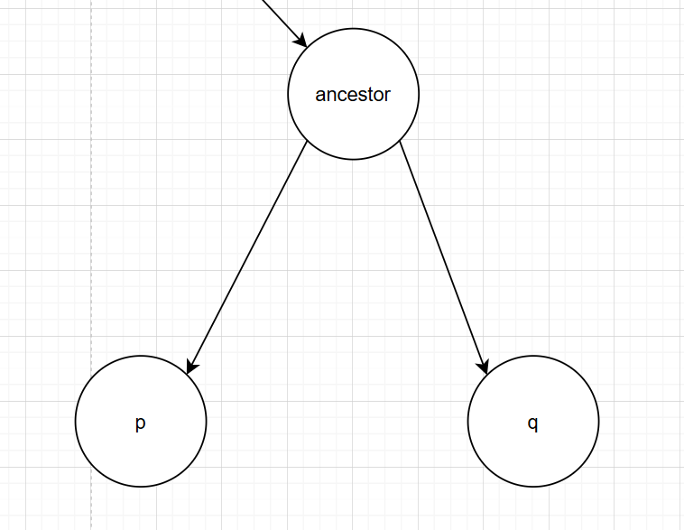
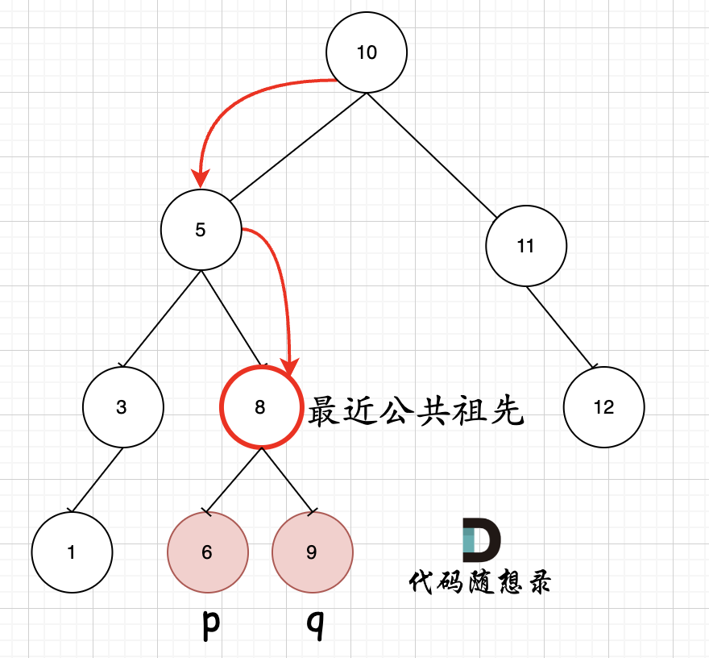

# LeetCode235_LowestCommonAncestor 寻找二叉搜索树的最近公共祖先_middle

> [LeetCode235 寻找二叉搜索树的最近公共祖先](https://leetcode.cn/problems/lowest-common-ancestor-of-a-binary-search-tree/description/)

## 分析

对于这个题目我们需要知道二叉搜索树的最近公共祖先的值 与 从上往下搜**第一个**满足 $root.val \in [p.val, q.val](p 和 q 分别是给出的两个要查找的节点)$，证明请看证明章节。

## 代码

```C#
public TreeNode LowestCommonAncestor(TreeNode root, TreeNode p, TreeNode q)
{
    if(root is null) return root;
    // 从上往下搜
    if(root.val > p.val && root.val > q.val) return LowestCommonAncestor(root.left, p, q);
    if(root.val < p.val && root.val < q.val) return LowestCommonAncestor(root.right, p, q);

    return root;
}
```

## 证明

证明命题：在 BST 中，对于p 和 q 的公共祖先 ancestor（对于非空树且包含 q 和 p 的 BST，p 和 q 一定有公共祖先，不需要考虑没有公共祖先），若 $ancestor.val \in [p.val, q.val]$，则 ancestor 为他们的最近公共祖先。

**证明：**
**充分性证明：**
反正法：即证若 $ancestor.val \in [p.val, q.val]$ 不是他们的最近公共祖先。

1. 若 ancestor.val == p.val / q.val 明显相悖，假设错误。
2. 若 $ancestor.val \in (p.val, q.val)$，则会有以下情况，这样若不是最近祖先，说明ancestor 下面还有公共祖先，假设这个为 root2，那么 root2 一定为 ancestor 的左子树或者右子树，那么 ancestor.val 要么 < p.val < q.val ，要么 > q.val > p.val，此时与一开始的假设相悖，证毕。充分性证明完毕。



**必要性证明：**

若 ancestor.val > q.val > p.val，说明 p 和 q 是 ancestor 的左子树中的节点，那么说明还可以继续顺着左子树向下搜寻祖先。若 ancestor.val < q.val < p.val 同上。
因此 ancestor.val 必须 $\in [p.val, q.val]$，必要性证明完毕。
综上，若 $ancestor.val \in [p.val, q.val]$，则 ancestor 为他们的最近公共祖先。

> **注意：**
> 大前提是一定是祖先，所以说从上往下搜比较好，从下往上会上面结论就有问题。比如 p 的右子树：p.right.val > p.val , p.right.val < q.val。


