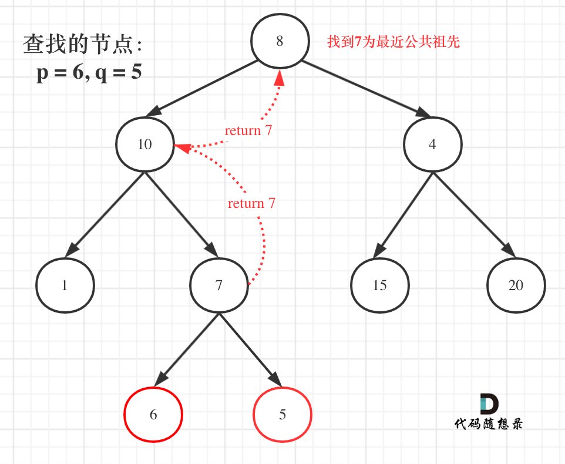

# LeetCode236_LowestCommonAncestor 二叉树的最近公共祖先_middle

> [二叉树的最近公共祖先](https://leetcode.cn/problems/lowest-common-ancestor-of-a-binary-tree/description/)

## 思路一：先找到两个节点的路径，然后比较路径

## 思路二：后续遍历（后序遍历是天然的回溯），自底向上找（回溯），找左右子树中是否存在，如果在左右子树找到 p、q 直接返回 root，一级一级向上返回root

先看[代码随想录讲解](https://programmercarl.com/0236.%E4%BA%8C%E5%8F%89%E6%A0%91%E7%9A%84%E6%9C%80%E8%BF%91%E5%85%AC%E5%85%B1%E7%A5%96%E5%85%88.html#%E7%AE%97%E6%B3%95%E5%85%AC%E5%BC%80%E8%AF%BE)，里面讲得比我好。
只补充一些理解可能存在问题的地方：
为什么 `if(left is null && right is not null) return left;`（另一种情况一样的），首先遇到 left 返回 left 的原因是自己就是自己最近的祖先。
然后，如下图所示，如果得到 7 为最近公共祖先之后，需要向上传，上面的代码也讲到了。

