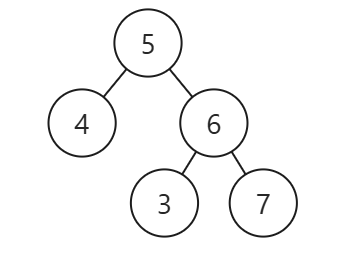

# LeetCode98_IsValidBST_middle

主要需要用到二叉搜索树的性质：二叉搜索树的中序遍历是严格递增的。

也就是说我们只需要证明中序遍历的时候 val 值是严格递增的。那么如何证明严格递增呢？只需证明在任何时候 $x_{n} > x_{n-1}$。

我们现在已经知道二叉树的中序搜索应该是一个严格递增的，也知道该怎么证明。那么现在就是如何进行代码书写，问题只有一个：**记录前一个节点的值** 。

那么我们就可以在遍历的时候记录一下节点即可。

> 易错点：
> 这个题还有一个易错点，不要只是认为对于一个树，只要左孩子小于这个节点，右孩子大于这个节点（ `if(root.val > root.left.val && root.val < root.right.val) return true;` ）就认为是搜索树，反例很简单：[5,4,6,null,null,3,7]即：
> 

代码如下：

```C#
// 递归法
TreeNode pre = null;
public bool IsValidBST2(TreeNode root)
{
    if(root is null) return true;
    bool left = IsValidBST2(root.left);
    if(pre is not null && pre.val >= root.val) return false;
    pre = root;
    bool right = IsValidBST2(root.right);
    return left && right;
}

// 迭代法
public bool IsValidBST2_Iteration(TreeNode root)
{
    if(root is null) return true;
    Stack<TreeNode> stack = new Stack<TreeNode>();
    TreeNode pre = null;
    while(stack.Count > 0 || root is not null)
    {
        while(root is not null)
        {
            stack.Push(root);
            root = root.left;
        }
        root = stack.Pop();
        if(pre is not null && pre.val >= root.val) return false;
        pre = root;
        root = root.right;
    }
    return true;
}
```
