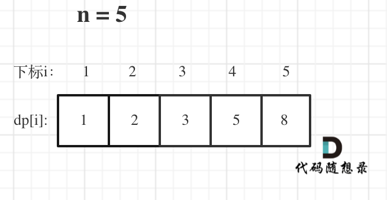

# LeetCode70_ClimbStairs_Easy

> [LeetCode70 爬梯子](https://leetcode.cn/problems/climbing-stairs/description/)

## 确定 dp 数组以及下标的含义

dp 应该是一个一维数组，每个索引 i 对应的就是爬 i 阶阶梯有多少种方法。

## 确定递推公式

如何可以推出dp[i]呢？

从dp[i]的定义可以看出，dp[i] 可以有两个方向推出来。

首先是dp[i - 1]，上i-1层楼梯，有dp[i - 1]种方法，那么再一步跳一个台阶不就是dp[i]了么。

还有就是dp[i - 2]，上i-2层楼梯，有dp[i - 2]种方法，那么再一步跳两个台阶不就是dp[i]了么。

那么dp[i]就是 dp[i - 1]与dp[i - 2]之和！

所以dp[i] = dp[i - 1] + dp[i - 2] 。

在推导dp[i]的时候，一定要时刻想着dp[i]的定义，否则容易跑偏。

这体现出确定dp数组以及下标的含义的重要性！

## dp 数组如何初始化

不用管 dp[0] 的定义，直接看 dp[1] 和 dp[2] 即可。然后从 dp[3] 开始递推即可。

## 确定递推顺序

从递推公式可以知道 dp[i] = dp[i -1] + dp[i -2] 可知，应该从前往后进行遍历。

## 举例推导 dp 数组

直接 n = 5，dp 数组：


这其实就是斐波拉契数列，当然也就可以向 LeetCode509 斐波拉契数列一样不用数组，而是采用两个 int 来减少空间复杂度。

## 代码

```CSharp
namespace LeetCode_Csharp.Code.DynamicProgramming
{
    public class LeetCode70_ClimbStairs_Easy
    {
        public int ClimbStairs(int n)
        {
            if (n == 1) return 1;
            int nexttoLast = 1, last = 2;
            for (int i = 0; i < n - 2; i++)
            {
                int temp = last + nexttoLast;
                nexttoLast = last;
                last = temp;
            }
            return last;
        }
    }
}
```
