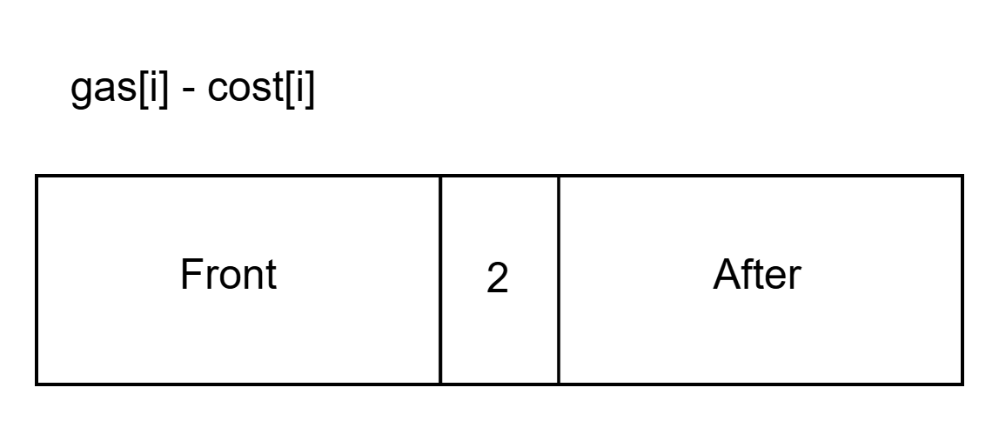

# LeetCode134_CanCompleteCircuit_middle

> [LeetCode134 加油站](https://leetcode.cn/problems/gas-station/description/)

## 思路

时间复杂度为 O(n)。空间复杂度：O(1)。
我们要判断是否能够到达是否能够绕一圈行驶，使用 O(n) 时间复杂度我们一轮轮询进行处理。

### 核心思路

如下图所示，我们就记录 Front 和 After 的累计 gas[i] - cost[i]（After 要记录自身，即 i ），通过记录这两个，我们可以通过判断 After 是否能够满足 Front，即可判断 i 是否能够跑一圈。


#### After 和 Front 的记录

**Front 记录：**
Front 只需要记录最大的累计耗补差即可。首先，Front 记录的是从 0 到 i 的累计耗补差，那么最后可能会是：[-2，-2，-2，3，3]，我们不能直接统计累计耗补差，这样如上数组所示，累计耗补差为 0，但是其实从最后一站到 0 到 3这个站需要 6 个油，但是这个存储的是累计耗油比，这样肯定是不可能达到 3 站，因此我们需要存储的不是绝对的累计耗补差。
那么我们需要存储的是应该是最小的累计油耗差（因为是负值，所以记录最小）。原因如下：如果从 0 -> s -> i-1，0 到 i-1 需要的最小累计油耗差为 gasMax[i-1]，而 0 到 s 需要的更少，所以肯定能到 s，**运用数学归纳法就可以推出来**到 i-1，因此存储最小的累计油耗差。
**After 的记录：**
因为采用的是一轮for，因此我们随着 for 循环记录即可。遇到 gas[i] - cost[i] >= 0，我们就开始用一个 int 记录累计油耗差，用 index 记录开始车站：

* 如果累计油耗差 < 0，就抛弃这个 index，并且不需要从 index + 1，进行，直接顺着 for 进行。原因如下：
因为 i 处 gas[i] - cost[i] >= 0，如果中间存在一个位置 m 能够绕一周的，那说明能够从 i 到 m，那这样就说明了可以从 i 到 m，而 m 可以绕一周，那么 i 应该也可以绕一周，这就与条件相悖，说明中间不存在这样的位置，因此，我们就不用往回溯，直接顺着for 循环继续即可。

### 代码

```C#
namespace LeetCode_Csharp.Code.GreedyAlgorithm
{
    public class LeetCode134_CanCompleteCircuit_middle
    {
        public int CanCompleteCircuit(int[] gas, int[] cost)
        {
            if(gas.Length == 1) return gas[0] - cost[0] >= 0 ? 0 : -1;

            int gasMax = int.MaxValue, gasMaxIndex = 0;
            int gasCostSubFromZero = 0;
            int gasCostSubFromValid = 0;
            int index = 0;
            bool startSum = false;
            for (int i = 0; i < gas.Length; i++)
            {
                if(i > 0) gasCostSubFromZero += gas[i - 1] - cost[i - 1];
                gasMax = gasCostSubFromZero < gasMax ? gasCostSubFromZero : gasMax;
                // 收集从 0 开始到 i 站所缺少的油量
                // 用于判断从数组的末尾站到初始站需要至少需要多少油量才能到达首站

                int gasCost = gas[i] - cost[i];
                if(gasCost >= 0 && startSum == false)
                {
                    gasMaxIndex = gasMax;
                    startSum = true;
                    index = i;
                }

                if(startSum == true)
                {
                    gasCostSubFromValid += gasCost;
                    if(gasCostSubFromValid < 0)
                    {
                        startSum = false;
                        gasCostSubFromValid = 0;
                    }
                    if(i == gas.Length - 1 && gasCostSubFromValid >= -gasMaxIndex)
                        return index;
                }
                
                
            }

            return -1;
        }
    }
}
```
