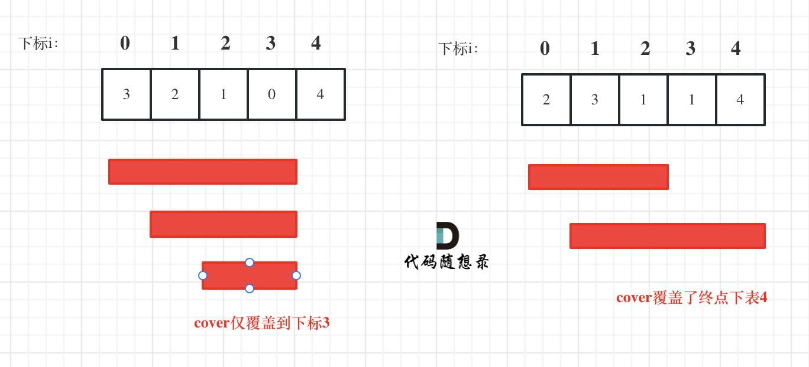

# LeetCode55_CanJump_middle

> [LeetCode55 跳跃游戏](https://leetcode.cn/problems/jump-game/description/)

- [LeetCode55\_CanJump\_middle](#leetcode55_canjump_middle)
  - [思路](#思路)
    - [思路一：最大范围](#思路一最大范围)
    - [代码](#代码)
    - [思路二：跳零](#思路二跳零)

## 思路

### 思路一：最大范围

如我自己的答题思路差不多，但是不用再重复搜索，此处时间复杂度为 O(n)，我们确实只用看是否能够超过或达到 nums.Length - 1，也就是看**跳跃的范围能否达到 nums.Length - 1**，但是如下图所示，因为跳跃范围是动态的，那么如何实现这个动态的范围呢？这就考验我们的工程能力了，因此这道题也可以是算是增加我们工程能力的题目。

其实解决动态范围直接更改 for 循环中的 判断条件中的上限即可。

### 代码

```CSharp
public class Solution
{
    public bool CanJump(int[] nums)
    {
        int cover = 0;
        if (nums.Length == 1) return true;
        for (int i = 0; i <= cover; i++)
        {
            cover = Math.Max(i + nums[i], cover);
            if (cover >= nums.Length - 1) return true;
        }
        return false;
    }
}
```

### 思路二：跳零

这种思想是因为题目说明了数组中均为非负整数，步数为正的时候肯定能往前走，而且至少走一步，那么如果数组中没有零，所有的均为正数，那么就算每次走一步都能走到。实际问题就是**是否能够跨过 0**。那么代码思路就是从后往前搜索，每次遇到零就开始判断前面是否有步数能够跨过 0，如果有则能到达。
