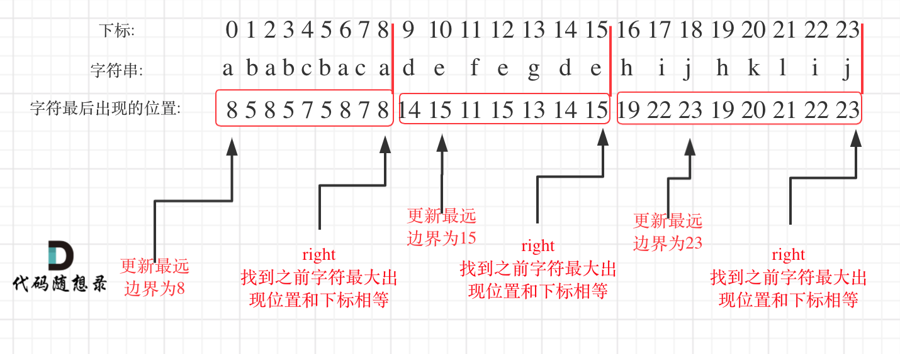

# LeetCode763_PartitionLabels_middle

> [LeetCode763 划分字母区间](https://leetcode.cn/problems/partition-labels/description/)

## 代码思路

一想到分割字符串就想到了回溯，但本题其实不用回溯去暴力搜索。

题目要求同一字母最多出现在一个片段中，那么如何把同一个字母的都圈在同一个区间里呢？

如果没有接触过这种题目的话，还挺有难度的。

在遍历的过程中相当于是要找每一个字母的边界，如果找到之前遍历过的所有字母的最远边界，说明这个边界就是分割点了。此时前面出现过所有字母，最远也就到这个边界了。

可以分为如下两步：

1. 统计每一个字符最后出现的位置
2. 从头遍历字符，并更新字符的最远出现下标，如果找到字符最远出现位置下标和当前下标相等了，则找到了分割点
如图：



## 代码

```Csharp
namespace LeetCode_Csharp.Code.GreedyAlgorithm
{
    public class LeetCode763_PartitionLabels_middle
    {
        public IList<int> PartitionLabels(string s)
        {
            int[] hash = new int[26];
            for (int i = 0; i < s.Length; i++)
            {
                hash[s[i] - 'a'] = i;
            }

            List<int> result = [];
            int left = 0, right = 0;
            for(int i = 0 ; i < s.Length; i++)
            {
                right = Math.Max(hash[s[i] - 'a'], right);
                if(right == i)
                {
                    result.Add(right - left + 1);
                    left = i + 1;
                }
            }
            return result;
        }
    }
}
```
