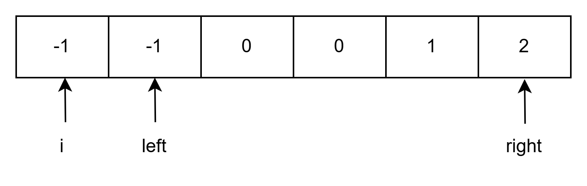
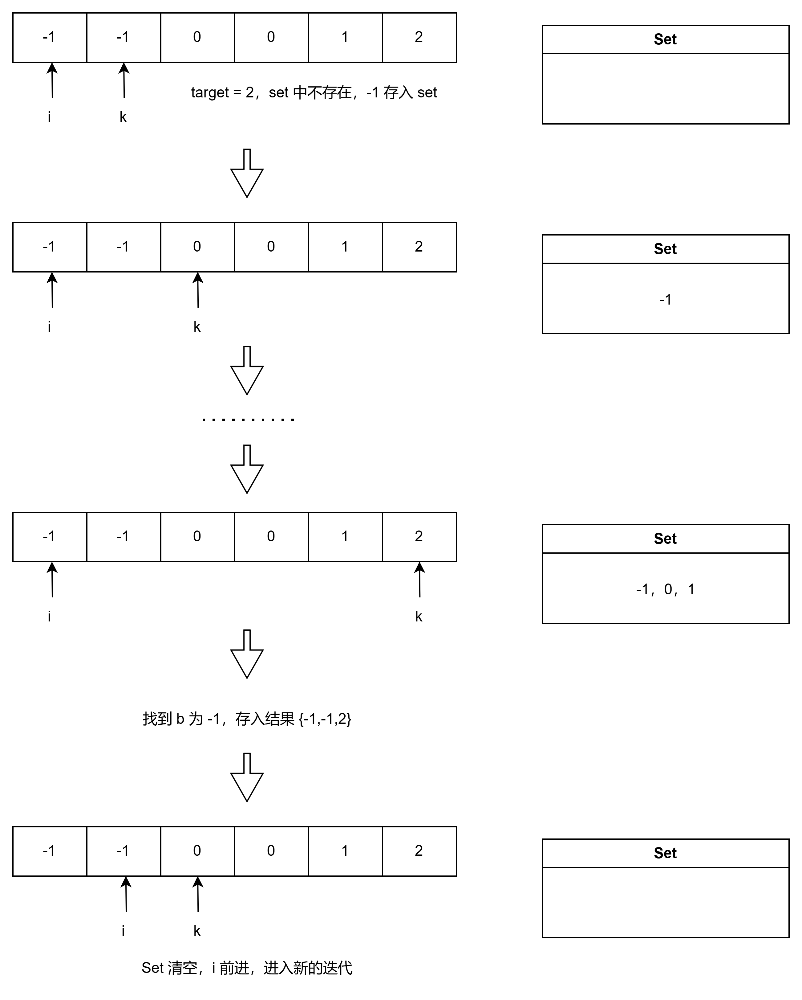

# LeetCode15_ThreeSum 三数之和_middle

> [LeetCode15 三数之和](https://leetcode.cn/problems/3sum/description/)

## 目录

- [LeetCode15\_ThreeSum 三数之和\_middle](#leetcode15_threesum-三数之和_middle)
  - [目录](#目录)
  - [双指针法](#双指针法)
    - [细节在于去重](#细节在于去重)
  - [哈希表法](#哈希表法)

## 双指针法

本题目使用哈希法会较为麻烦，而且细节处理也较为麻烦。转为其他思路比较好，采用双指针来处理会更好。

**核心思路如下：**
先对数组进行排序，对**排序后**的数组进行处理。如下所示，三数之和：a + b + c = 0，我们逐个遍历，i 为 a，然后双指针 left 和 right 分别从 i 的右边一位和数组的最后一位开始迭代:

1. 如果 nums[i] + nums[left] + nums[right] > 0：说明加的数太大了，应该变小一点，那么注意这个数组是**已经排序过的**，所以应该将 right 向左移动一位，这样整体相加就变小了，然后继续判断。
2. 如果 nums[i] + nums[left] + nums[right] < 0：说明整体偏小，我们就将 left 向右移动一位，这样整体相加就变大了，然后继续判断。
3. 如果 nums[i] + nums[left] + nums[right] = 0：说明合适，我们就将此时 nums[i]，nums[left]，nums[right] 记录到结果中。然后继续迭代。

结束循环的方式：如果 left 和 right 迭代到最后 left = right 了，就说明没有合适的，停止迭代。



### 细节在于去重

1. **对 a 去重：**
我们可以通过判断 nums[i] == nums[i-1] 对 a 进行去重：
如果二者相等，说明这个数已经判断过是否存在合适的三元组了（毕竟是逐个遍历判断的是否存在，所以如果现在这个等于之前的，那么说明这个已经判断过了，就直接 contiune 即可。

> **为什么不是判断 nums[i] == nums[i+1]?**
结果中三元组中的值是可以相同的，比如 {-1，-1，2}，如果通过判断
nums[i] == nums[i+1] ，会导致判断 -1 的时候发现后一个也是 -1 直接就 Continue 了，这样会漏过 {-1,-1,2} 的这个结果。

2. **对结果（或者说对 left 和 right 去重）进行去重：**
方式：left 和 right 在收获结果之后如果遇到相同的就继续移动。
因为我们已经记录过一次对应的 left 和 right 了，就不能继续再次记录（题目要求不重复），所以在遇到相同的地方就移动指针跳过去。

**具体代码如下：**

```C#
public IList<IList<int>> ThreeSum(int[] nums)
{
    //排序
    Array.Sort(nums);
    List<IList<int>> res = new();


    for (int i = 0; i < nums.Length; i++)
    {
        // 当 nums[i] > 0 时，它与后续的数组不论如何都不能继续加成 0 （已排序）
        if(nums[i] > 0) return res;

        //对 i 进行去重
        if(i > 0 && nums[i] == nums[i-1]) continue;

        //准备指针
        int left = i + 1, right = nums.Length - 1;
        while(left < right)
        {
            // 去重复逻辑如果放在这里，0，0，0 的情况，可能直接导致 right<=left 了，从而漏掉了 0,0,0 这种三元组
            /*
            while (right > left && nums[right] == nums[right - 1]) right--;
            while (right > left && nums[left] == nums[left + 1]) left++;
            */
            int sum = nums[i] + nums[left] + nums[right];
            if(sum > 0) right--;
            else if(sum < 0) left++;
            else
            {
                res.Add([nums[i], nums[left], nums[right]]);
                //对 left 和 right 进行去重
                while(left < right && nums[left] == nums[left + 1]) left++;
                while(left < right && nums[right] == nums[right - 1]) right--;

                //找到答案的时候，左右指针同时移动
                left++;
                right--;
            }
        }
    }
    return res;
}
```

## 哈希表法

核心思路与双指针有类似，但是不完全一样：也是先进行排序，然后进行遍历，nums[i] 为 a，但是后续处理与双指针不一样：
该方法是从 a 即 nums[i] 后一位开始进行再次遍历，用一个 set 装 b。遍历的数(nums[k]) 为 c，每次遍历都在 set 中查找 target = -nums[i]-nums[k]，如果没有就将此时的数字 c 装进 set 中成为 b 的一员。采用 HashSet\<int\> 可以避免重复装入 b。



**代码如下：**

```C#
// 哈希表法
// 时间复杂度：O(n^2)，空间复杂度：O(n)
public IList<IList<int>> ThreeSum2(int[] nums)
{
    //排序
    Array.Sort(nums);

    List<IList<int>> res = [];

    //nums[i] 为 a
    for(int i = 0; i < nums.Length; ++i)
    {
        if(nums[i] > 0) break;
        //对 a 进行去重
        if(i > 0 && nums[i] == nums[i-1]) continue;

        //哈希表存储 b
        HashSet<int> set = [];

        for(int j = i + 1; j < nums.Length; ++j)
        {
            //对 c 进行去重，同时去重 b=c 时的结果
            if(j > i+2 && nums[j] == nums[j-1] && nums[j] == nums[j-2]) continue;

            int target = -nums[i] - nums[j];
            if(set.Contains(target))
            {
                res.Add([nums[i], target, nums[j]]);
                // 对 b 进行去重，不必担心 a 移动后的 b 重复，因为 a 移动后，b 会重新计算
                // 而且必须去重，此时 a 是定的，b 如果不去重，那么 c 如果后续还有一样的值，会导致重复
                // 比如： {-2,0,0,2,2}
                set.Remove(target);
            }
            else
            {
                set.Add(nums[j]);
            }
        }
    }

    return res;
}
```
