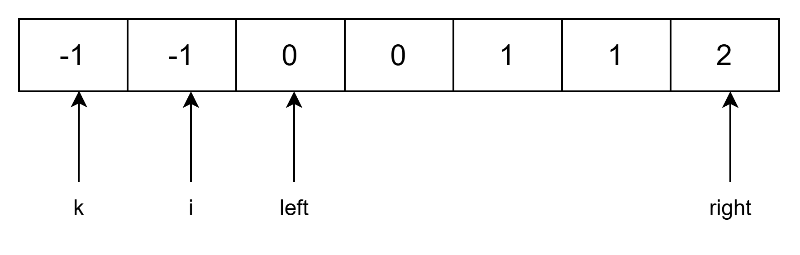

# LeetCode18_FourSum 四数之和_middle

本题其实与三数之和无太大差别，可以是说是三数之和的延续题目，但是需要注意一些三数之和没有的细节，尤其是三数之和的 target 是 0，但是四数之和的 target 没有要求，可能是任何值。因此在进行剪枝（剪去分支）的时候要注意！

主要思路就是三数之和的延续，只不过是在前面再加上一个索引 k 进行遍历：


先逐个遍历，然后对 k 右边的进行三数之和遍历即可。

## 细节

与三数之和不同的是需要注意很多细节，不要依据三数之和的惯性思维进行做题。

### 细节 1：nums[k] 和 nums[i] 的剪枝

1. **nums[k]**
需要注意的是，四数之和并不是三数之和那个题目 target = 0，而是任意数，所以我们进行剪枝的时候要注意判断条件应该是，nums[k] 大于 target 同时 nums[k] > 0 才可以进行剪枝。因为只有 nums[k] 达到正数之后，在继续加正数才会一直大于 target，如果 nums[k] 是负数的话，后续数也可能为负数，继续加会减小，仍可能达到 target，比如 target = -3，nums[k] 为 -2，-2 > -3，但是此时不能 break，因为后续 nums[i] 若为 -1，则能达到题目条件，但是正数则不行，因为正数加正数只会变大。
2. **nums[i]**
剪枝思路和 nums[k] 大差不差，主要细节就是注意一下第二个判断中用 nums[i] + nums[k] > 0 也行，用 nums[i] > 0 也行。

**代码如下：**

```C#
public class LeetCode18_FourSum_middle
    {
        #region 无剪枝四数之和
        //时间复杂度：O(N^3)
        public IList<IList<int>> FourSum(int[] nums, int target)
        {
            //排序
            Array.Sort(nums);
            List<IList<int>> res = new();

            int index = 0;
            while (index < nums.Length - 3)
            {
                List<IList<int>> threeSum = ThreeSum(nums[(index + 1)..], target - nums[index]);
                foreach (var item in threeSum)
                {
                    item.Add(nums[index]);
                    res.Add(item);
                }

                while (index < nums.Length - 3 && nums[index] == nums[index + 1])
                {
                    index++;
                }
                index++;
            }
            return res;
        }

        public List<IList<int>> ThreeSum(in int[] nums, int target)
        {
            List<IList<int>> res = new();

            //O(N)
            for (int i = 0; i < nums.Length; i++)
            {
                // 三数之和：当 nums[i] > 0 时，它与后续的数组不论如何都不能继续加成 0 （已排序）
                // 但是四数之和要注意：不是 0 的情况，不需要返回，因为不是 0 的情况，可能有后续的数组可以加成 target
                // 比如负数：-4 + -1 是可以达到更小的 -5 的。
                // if (nums[i] > target) return res;
                // 对 i 进行去重
                if (i > 0 && nums[i] == nums[i - 1]) continue;

                //准备指针
                int left = i + 1, right = nums.Length - 1;
                while (left < right)
                {
                    // 去重复逻辑如果放在这里，0，0，0 的情况，可能直接导致 right<=left 了，从而漏掉了 0,0,0 这种三元组
                    /*
                    while (right > left && nums[right] == nums[right - 1]) right--;
                    while (right > left && nums[left] == nums[left + 1]) left++;
                    */
                    long sum = (long)nums[i] + (long)nums[left] + (long)nums[right];
                    if (sum > target) right--;
                    else if (sum < target) left++;
                    else
                    {
                        res.Add([nums[i], nums[left], nums[right]]);
                        //对 left 和 right 进行去重
                        while (left < right && nums[left] == nums[left + 1]) left++;
                        while (left < right && nums[right] == nums[right - 1]) right--;

                        //找到答案的时候，左右指针同时移动
                        left++;
                        right--;
                    }
                }
            }
            return res;
        }
        #endregion 无剪枝四数之和

        #region 有剪枝四数之和
        //延续三数之和但是要注意细节。
        //时间复杂度：O(N^3)
        public IList<IList<int>> FourSum2(int[] nums, int target)
        {
            //排序
            Array.Sort(nums);
            List<IList<int>> res = [];

            for (int k = 0; k < nums.Length; k++)
            {
                // 剪枝：已经排序后，如果当前 nums[k] 大于 target，且大于 0，
                // 那么后续的数组不可能加成 target，因为后面的数肯定大于 nums[k]，
                // 怎么加都会大于 target
                if (nums[k] > target && nums[k] > 0) break;

                //去重
                if (k > 0 && nums[k] == nums[k - 1]) continue;
                for (int i = k + 1; i < nums.Length; i++)
                {
                    // 剪枝：已经排序后，如果当前 nums[i] + nums[k] 大于 target - nums[k]，且大于 0，
                    if (nums[i] + nums[k] > target && nums[i] + nums[k] > 0) break;
                    //if (nums[i] + nums[k] > target && nums[i] > 0) break; 也是一样的，后面那个判断加不加 nums[k] 不影响结果
                    // 去重
                    if (i > k + 1 && nums[i] == nums[i - 1]) continue;

                    int left = i + 1, right = nums.Length - 1;
                    while(left < right)
                    {
                        //防止数据溢出
                        long sum = (long)nums[k] + (long)nums[i] + (long)nums[left] + (long)nums[right];
                        if (sum > target) right--;
                        else if (sum < target) left++;
                        else
                        {
                            res.Add([nums[k], nums[i], nums[left], nums[right]]);
                            //对 left 和 right 进行去重
                            while (left < right && nums[left] == nums[left + 1]) left++;
                            while (left < right && nums[right] == nums[right - 1]) right--;

                            //找到答案的时候，左右指针同时移动
                            left++;
                            right--;
                        }
                    }
                }
            }

            return res;
        }
        #endregion 有剪枝四数之和
    }
```
