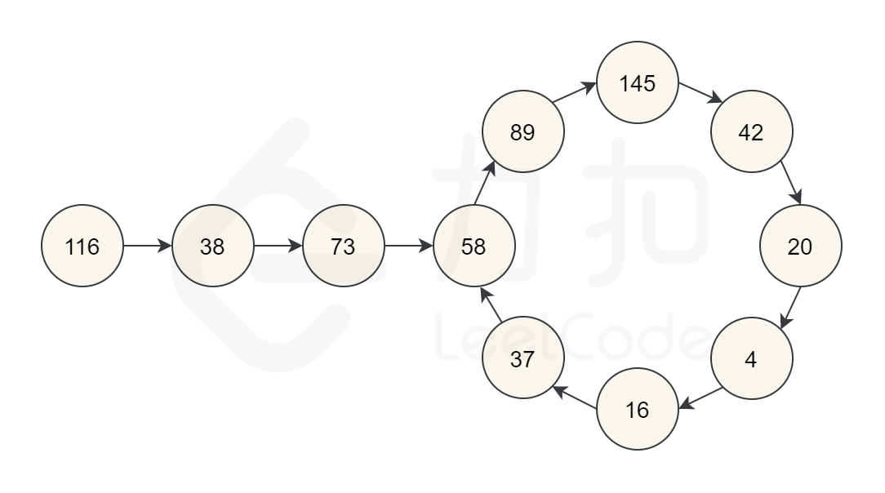

# LeetCode202_IsHappy 快乐数_Easy

> [LeetCode202 快乐数](https://leetcode.cn/problems/happy-number/description/)

题目分析：
这看似上是一道数学题，其实只涉及少量推理。主要要注意题目所给出的提示：**无限循环** 。注意题目说道*也可能是无限循环但始终不到1*，这里说无限循环，也就是说如果到不了1可能是加着加着不断在一个循环中进行，如下图所示。

综上，我们可能有以下三种情况：

1. 最终到 1
2. 最终进入循环
3. 值越来越大，最后接近无穷大

第三种情况的方式证明方式见 [LeetCode 题解](https://leetcode.cn/problems/happy-number/solutions/224894/kuai-le-shu-by-leetcode-solution/)，这里只写结论：数字不会越来越大，最后会在 243 以下循环或最终循环到 1。
因此，只需要考虑 1 和 2 两种情况。

## 方法 1：哈希表

我们将每次各个位数的平方和相加后的结果记录下来，每次平方和后再哈希表中查找，如果哈希表中能查找到说明发生重复，说明进入了循环，就可以`return false` 了。

代码：
时间复杂度：O(logN)；空间复杂度：O(logN)

```C#
public bool IsHappy(int n)
{
    HashSet<int> set = [];
    int res = 0;
    while(res != 1)
    {
        res = 0;
        while(n != 0)
        {
            res += n % 10 * (n % 10);
            n /= 10;
        }
        if(set.Contains(res))
        {
            return false;
        }
        set.Add(res);
        n = res;
    }
    return true;
}
```

## 方法 2：快二慢一双指针

我们都看到循环了，我们就可以通过设置快二慢一双指针进行判断这个循环。

```C#
public bool IsHappy(int n)
{
    int slow = n, fast = n;
    do
    {
        slow = GetNext(slow);
        fast = GetNext(GetNext(fast));
    }while(slow != fast)

    return slow == 1;
}

private int GetNext(int n)
{
    int res = 0;
    while(n != 0)
    {
        res += n%10 * (n%10);
        n /= 10;
    }
    return res;
}
```
