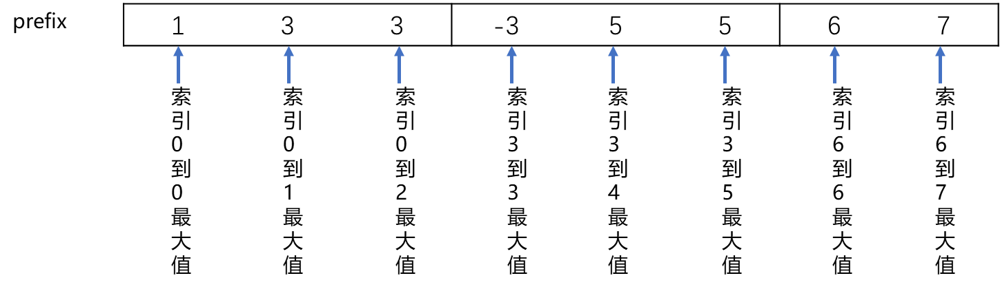

# LeetCode239_maxSlidingWindow_hard

大顶堆会导致无法 pop 出去。

## 单调队列

这个题目很清楚的可以采用队列，刚好一进一出，但是如何表示每次的最大值？那么我们就要对每次 push 后的结果进行排序，但是这样很费时间，最大值应该在出队口，要不然也不知道最大值。

那么我们该怎么进行排序以及元素的删除？保证排序不会毁坏以后可能的最大值的同时，保证最大只能够在队尾？

因此有一个想法：队列没必要维护窗口中的所有元素，只需要维护可能成为窗口里最大值的元素即可，同时保证队列中的元素值是从大到小的。

那么我们需要的这种队列就是单调队列（或者说：单调**双头**队列）。

**总结：** 采用单调队列，维护这种单调队列，我们只维护队列中的最大值。

> 解释：
> **单调队列：** 即单调递减或单调递增的队列。单调队列不是一种特定的数据结构，完全取决于你的写法。
> 但是：不要实现的单调队列就是 对窗口里面的数进行排序，如果排序的话，那和优先级队列又有什么区别了呢。

那么我们怎么维护这样一个单调双向队列？

* pop() : 我们维护的是一个单调队列，队尾存储的是这个窗口中的最大值，而不是窗口的最左边的值，所以不要随便 pop，需要判断。正确pop：每次窗口移动会移除最左端元素，所以我们只需比较这个删除的最左端元素的值是否和当前队列中的最大值，也就是此时队列的尾端的值相同，如果相同就除去，否则就不 pop 队列中尾段的值。
代码如下：

```C#
pop(int x)
{
    if(queue.Count != 0 || x == queue.tail)
        queue.Dequeue();
}
```

* push()：我们每次 push，进来的是一个完全的新值，我们并不知道它在队列中的大小，所以我们需要比较，但是正如前言，我们要维护是一个单调队列。因此我们要从对头开始遍历，除去所有小于此次加入的新值，这样我们就可以保证这个队列中依然是单调队列。并且也保留了这个可能成为最大值的元素。

> 为什么敢除去前面比新值小的值？
> 对于一个数组（我们要进行滑动窗口的对象）：253490，我们每次都是从前往后加入新元素，也就是说左边的元素会比新加入的元素先离开窗口，那么如果左边元素比新加入的元素小，他就不可能在他的生命周期中成为这个窗口的最大值，因为他总是先于这个新加入的大于他的新元素离开窗口。因此我们每次新加入一个元素后，肯定可以出去以前比这个元素小的元素的，这也是这个队列 push 的核心思想。

* tail() ：返回队列的尾部值

因此对于这个题目，我们只需移动窗口的时候依次调用 pop,push，然后将 tail 加入结果中即可。
完整实现代码：

```C#
public int[] MaxSlidingWindow(int[] nums, int k)
{
    MyQueue myQueue = new MyQueue();
    // int[] result = new int[nums.Length - k + 1];
    List<int> result = new List<int>();

    //初始化窗口
    for (int i = 0; i < k; i++)
    {
        myQueue.Enqueue(nums[i]);
    }
    // result[0] = myQueue.Max();
    result.Add(myQueue.Max());

    for (int i = k; i < nums.Length; i++)
    {
        myQueue.Dequeue(nums[i - k]);
        myQueue.Enqueue(nums[i]);
        // result[i - k + 1] = myQueue.Max();
        result.Add(myQueue.Max());
    }

    return result.ToArray();
}

public class MyQueue
{
    //First 是尾巴，Last 是头
    //从右往左的队列
    private LinkedList<int> queue = new LinkedList<int>();

    public void Dequeue(int val)
    {
        if (queue.Count > 0 && val == queue.First.Value)
        {
            queue.RemoveFirst();
        }
    }

    public void Enqueue(int val)
    {
        while (queue.Count > 0 && queue.Last.Value < val)
        {
            queue.RemoveLast();
        }
        queue.AddLast(val);
    }

    public int Max()
    {
        return queue.First.Value;
    }

}
```

## 分块 +  预处理：思想巧妙

【方法3：分块和预处理】的个人理解

对第三种方法的理解，不得不说分块和预处理的方法真巧妙，题解说的前缀和后缀不太直观，我这里举个题目的例子来说明就好了，k=3。


preffix[i]存的是各个分组从分组开头到索引i的最大值（i % k == 0的值为各个分组的开头，这里对应是0,3,6），因为是从分组开头开始，所以是从左往右遍历，每次到分组的新的开头（进入新的分组），preffix[i]就直接更新为分组开头的元素，因为是从前往后遍历，所以是前缀最大值。看下面的例子：



suffix[i]存的是各个分组从分组末尾到索引i的最大值（ (i + 1） % k == 0或最后一个索引的值为各个分组的末尾，这里对应是2,5,7），因为是分组末尾开始，所以是从右往左遍历，每次到分组的新的末尾（进入新的分组），suffix[i]就直接更新组为分组末尾的元素。因为是从后往前遍历，所以是后缀最大值。看下面的例子：


一个窗口最常见的情况是元素分别落入两个分组：落入两个分组时，前一个分组我们使用suffixMax[i]获得索引为i的前缀最大值（范围是i到这个分组的末尾，从右往左，对应是后缀），后一个分组我们使用prefixMax[i+k-1]获得索引为i+k-1的后缀最大值（范围是这个分组的开头到i+k-1，从左往右，对应是前缀），这两个值再比较得到的最大值就是整个窗口的最大值。

而另一种窗口的情况是元素落在一个分组里，这时候对应的suffixMax[i]的i是分组的开头，prefixMax[i+k-1]的i+k-1是这个分组的末尾，它们相当从两个方向对分组遍历获得了最大值，所以它们的值是一样的，这两个值再比较得到的最大值也是整个窗口的最大值。


> 该方法讲解转载自：
> 该[题目题解](https://leetcode.cn/problems/sliding-window-maximum/solutions/543426/hua-dong-chuang-kou-zui-da-zhi-by-leetco-ki6m/)中 **木木** 大佬理解。

简单理解：直接看最后一张图就能明白。
但是为什么不小一点？为什么不大一点？
小一点：不好找到对应的区间，中间会有干扰区间
大一点：会出现错误：比如下面这个如果 k 为 3 的情况下，窗口位于前 3 个数，但是 suffix 此时数值为 4 ，导致最后结果出错。
[1234]
