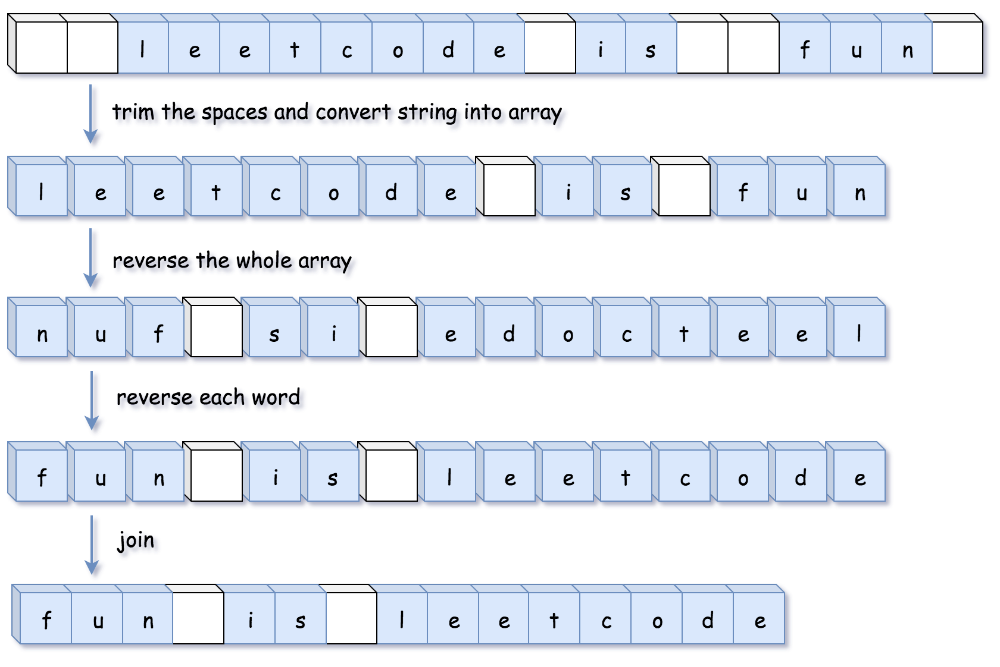
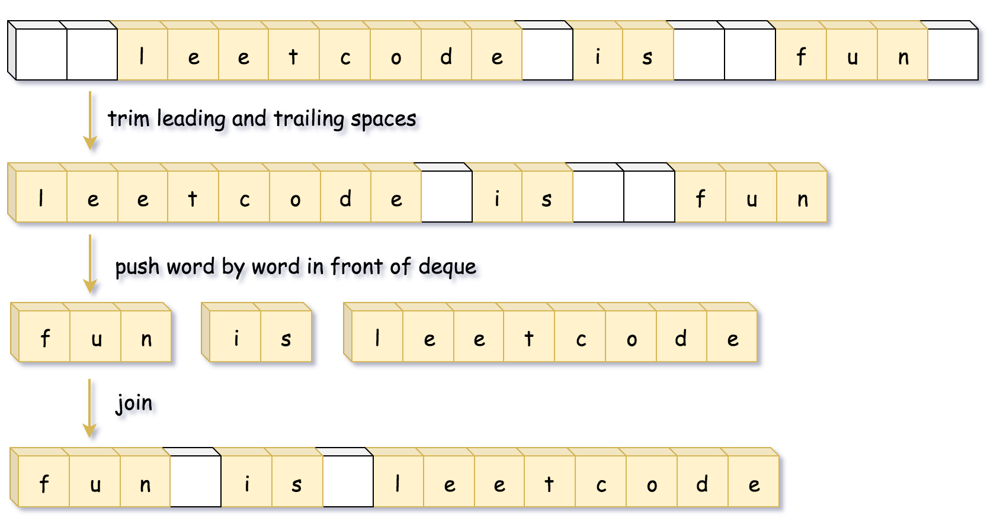

# LeetCode151_ReverseWords 反转字符串中的单词_middle

**目录：**

- [LeetCode151\_ReverseWords 反转字符串中的单词\_middle](#leetcode151_reversewords-反转字符串中的单词_middle)
  - [方法一：双指针去除多余空格，然后翻转整个字符串，最后翻转每个单词](#方法一双指针去除多余空格然后翻转整个字符串最后翻转每个单词)
  - [方法二：直接按顺序提取单词然后反向重组](#方法二直接按顺序提取单词然后反向重组)
  - [总结](#总结)

> [LeetCode151 反转字符串中的单词](https://leetcode.cn/problems/reverse-words-in-a-string/description/)

## 方法一：双指针去除多余空格，然后翻转整个字符串，最后翻转每个单词

> 时间复杂度：O(n)，
空间复杂度：O(1)(string 可修改的语言)，O(n)(string 不可修改的语言)

**核心思路：**
去除多余的空格（保持每个单词之间保持一个空格），然后**翻转整个字符串，最后单独翻转每个单词**，这样就能得到最后的结果，即单词翻转，如下图所示。

遍历的方式采用双指针：快指针遍历所有的字符，慢指针指向不为空格时 char 应该存储的位置。

这个题其实难点就在于去除如何去除多余的空格，如何在空间复杂度为 O(1) （也就是不创建新的string，当然这是对于 C++ 这类 string 可修改的语言，对于 string 不可修改的语言，要求在转换为 char[] 后不能再进行新空间的创建）的情况下进行多余空格的除去。其实思路很简单：

1. 在 fast 扫到不为空格/为字母的地方，就将 fast 所指的地方赋给 slow 指向的地方，随后两指针继续移动，slow 始终指向的是要赋值的地方，fast 指向的是当前遍历到的地方；
2. 当 fast 指向的是空格，就直接 fast 移动，slow 不动；
3. 单词之间添加空格：当 slow 指向的不是第一个位置的时候（因为开头不需要空格）才添加空格，而且在后面得有单词才添加空格（防止尾巴添加空格），那么方式就是，在 fast 指向的地方有字符的时候将 **slow 指向的地方赋值为空格**，然后再进行 1. 。

```C#
int slow = 0;
for(int fast = 0; fast < sArray.Length; fast++)
{
    if(sArray[fast] != ' ')
    {
        if(slow != 0) sArray[slow++] = ' ';
        while(fast < sArray.Length && sArray[fast] != ' ')
        {
            sArray[slow++] = sArray[fast++];
        }
    }
}
```

此外还需要注意一些细节：

- 在处理完空格后裁剪数组的空间，C++：`s.resize(slow);`；C#：`Array.Resize(ref sArray, slow);`。

> 为什么最后缩短为 slow 长度？
通过上述分析可知，slow 最后指向的是 如果 fast 指向的是字符最后该赋值的地方，也就是 slow 指向的是已经赋值的单词的后一个位置，因此 slow 也就代表着裁剪后 string 该有的长度。

**最终代码如下所示：**

```C#
public string ReverseWords(string s)
{
    int slow = 0;
    char[] sArray = s.ToCharArray();

    // 去除多余的空格
    for (int fast = 0; fast < s.Length; fast++)
    {
        // fast 所指向的不为空格
        if (sArray[fast] != ' ')
        {
            if (slow != 0) sArray[slow++] = ' ';
            while (fast < sArray.Length && sArray[fast] != ' ')
            {
                sArray[slow++] = sArray[fast++];
            }
        }
    }

    // 多余的空格去除之后，反转整个字符串
    // 注意：去除多余的空间
    /* Array.Resize()
        时间复杂度：
        1. 如果 n > sArray.Length，Array.Resize 会创建一个新的数组对象，将原数组复制进去，
        因此时间复杂度为 O(n)
        2. 如果 n <= sArray.Length，Array.Resize 会直接截断数组，则时间复杂度为 O(sArray.Length)
    */
    Array.Resize(ref sArray, slow);
    Array.Reverse(sArray);
    // 反转每个单词
    for (int start = 0, j = 0; j <= sArray.Length; j++)
    {
        if (j != sArray.Length && sArray[j] != ' ') continue;
        Array.Reverse(sArray, start, j - start);
        start = j + 1;
    }
    return new string(sArray);
}
```

## 方法二：直接按顺序提取单词然后反向重组

> 时间复杂度：O(n)
空间复杂度：O(n)

该方法思路相交而言较为直白，但是空间复杂度更高，因为需要借助 Stack。

**核心思路：**
首先提取出这里的每个单词，然后将单词从尾到头输出一遍并在中间加入空格即可。


**代码思路：**
检测每个单词的思路：
C# 就是设置一个 StringBuilder 来存储检测到的每一个单词（记得每次得到一个单词之后就重置为 ""），遍历当前字符串，遇到空格不处理直接再次遍历，遇到指向的是字符，就利用 StringBuilder 开始组成单词(Append 这个字符)，直到遇到空格，说明这个单词已经得到，就停止 StringBuilder 组成，将这个单词加入 Stack，直到遍历到结尾。

> 为什么使用 Stack 而不是 Queue？
因为这里是从头开始遍历，那么先进入数据结构的是第一个单词，而我们之后是要先取出最后一个单词，也就是后人先出（FILO），所以应该使用 Stack。
如果是从后往前遍历，就用 Queue。

**最后代码如下所示：**

```C#
public string ReverseWords2(string s)
{
    char[] sArray = s.ToCharArray();
    // 存储单词结果
    Stack<string> resStack = new();
    
    StringBuilder sb = new();
    // 去除空格，同时将单词取出来
    for(int i = 0; i < sArray.Length; i++)
    {
        if(sArray[i] == ' ') continue;

        while(i < sArray.Length && sArray[i] != ' ')
        {
            sb.Append(sArray[i++]);
        }
        resStack.Push(sb.ToString());
        sb.Clear();
    }

    while(resStack.Count > 0)
    {
        string str = resStack.Pop();
        sb.Append(str);
        if(resStack.Count > 0) sb.Append(' ');
    }
    return sb.ToString();
}
```

## 总结

- 注意双指针的运用。
- **思想记录：**我们在处理部分字符串的翻转（这个部分的string顺序不翻转，但是这个不分相较于整体是翻转的，比如 abcdefg -> fg 翻转到前面/或者说abcde翻转到后面 -> fgabcde）的时候，我们可以先全体翻转，然后分部分进行翻转。
