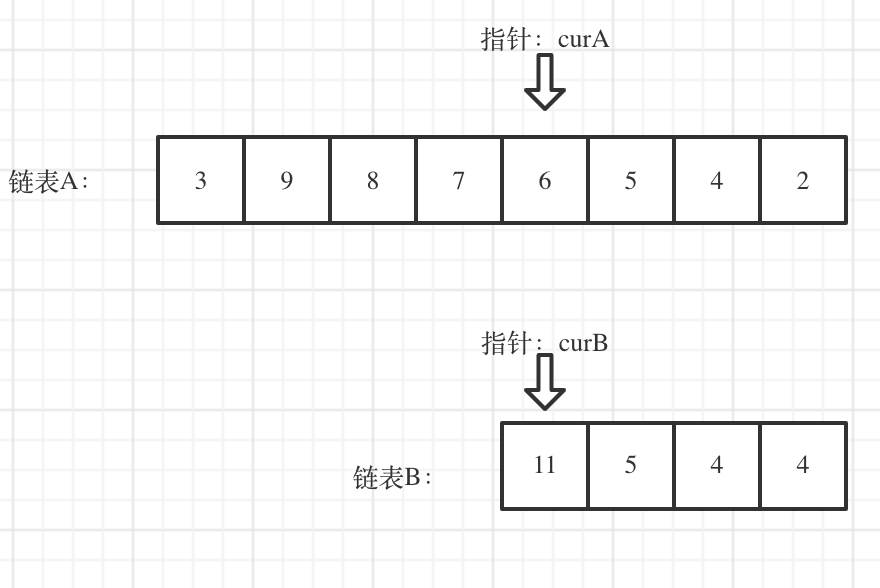

# LeetCode 面试题 02.07 链表相交

> [LeetCode题目：链表相交](https://leetcode.cn/problems/intersection-of-two-linked-lists-lcci/description/)

思路有很多，这里简单讲解两种。

主要要思考的是怎么让指针同步。

## Solution1 ：快慢指针进行同步

> O(m+n) ; O(1)

之前用过快慢指针的想法，所以我们可以先求出每一个链表的长度，然后就可以得出二者长度之差，通过让链表较长的那个先跑这个差实现同步，这里先跑的指针不会跑过相交的指针，因为 A 和 B 链表是在尾部相同，移动长度较长的链表后情况如下：

在编写代码的时候有些细节，我们可以直接让 lenA 和 pA 指向长度较长的链表，另一组指向长度较短的链表，这样就没必要通过判断 长度 进行代码复用了，这也是指针的妙用。

## Solution2 : 哈希表，思想简单，看代码就知道了

> O(m+n) ; O(n)/O(m)

## Solution3 ： 合并链表实现指针同步

> O(m+n) ; O(1)

我们让 pA 走完 A 之后走 B 链表，pB 走完 B 之后走 A 链表：
_: A  ; * : B\
$\space \space \downarrow$
--------****
$\space \space \downarrow$
****--------
就算二者长度不同，在第二轮 while 同步中，最后都会走到 相交节点，可能说的不是很好，结合代码比较好理解
